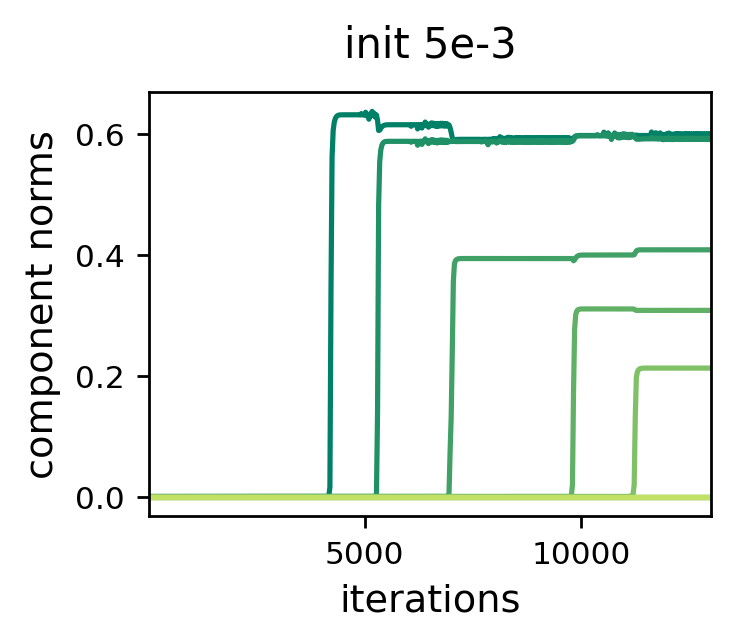
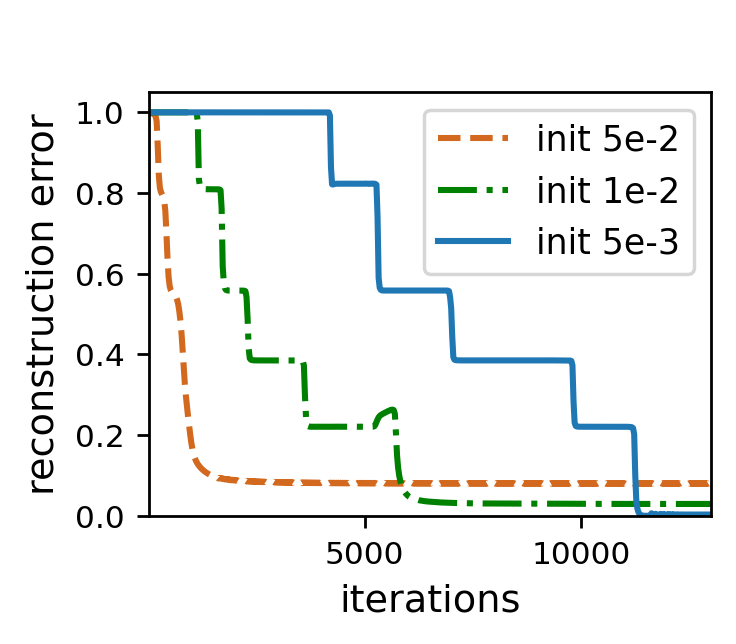
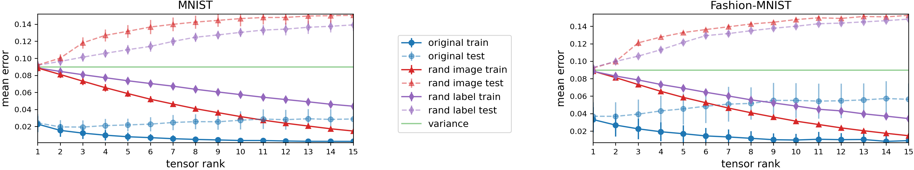

# Implicit Regularization in Tensor Factorization (ICML 2021)

Code, based on the PyTorch framework, for reproducing the experiments in [Implicit Regularization in Tensor Factorization](https://arxiv.org/abs/2102.09972) (ICML 2021).

## Install Requirements
Tested with python 3.8.
```
pip install -r requirements.txt
```


## 1. Dynamics of Learning

### 1.1 Generating Data

Generating data for synthetic tensor completion/sensing experiments is done by running:
```
python tensor_sensing_data_generator.py --task_type completion
```

- Setting ```task_type``` to "sensing" will generate tensor sensing data.
- Use the ```-h``` flag for information on the customizable run arguments.


### 1.2 Running Experiments

The following command runs a tensor completion/sensing experiment, fitting a tensor factorization to a given dataset:
```
python tensor_sensing_experiment_runner.py \
--dataset_path <path> \
--epochs 1000000 \
--num_samples 2000 \
--outputs_dir "outputs/syn" \
--save_logs \
--save_metric_plots \
--save_checkpoints \
--validate_every 25 \
--save_every_num_val 100 \
--epoch_log_interval 50 \
--train_batch_log_interval -1 \
--track_factor_norms 
```

- The ```dataset_path``` run argument should point to the dataset file generated in previous step.

- A folder with checkpoints, metric plots, and a log file will be automatically created under the directory specified by the ```outputs_dir``` run argument.

- Use the ```-h``` flag for information on the customizable run arguments.
  
  


### 1.3 Plotting Results

Plotting component norms against number of iterations for an experiment can be done by:
```
python tensor_sensing_results_plotter.py \
--experiments_checkpoint_paths <experiment_checkpoint_path> \
--metric_names top_component_0_fro_norm top_component_1_fro_norm top_component_2_fro_norm top_component_3_fro_norm top_component_4_fro_norm top_component_5_fro_norm top_component_6_fro_norm top_component_7_fro_norm top_component_8_fro_norm top_component_9_fro_norm \
--y_label "component norms" \
--plot_linewidth 1.5
```

Plotting reconstruction errors against number of iterations for multiple experiments can be done by:
```
python tensor_sensing_results_plotter.py \
--experiments_checkpoint_paths <experiment_checkpoint_path1> <experiment_checkpoint_path2> ... \
--per_experiment_label <label1> <label2> ... \
--metric_names normalized_reconstruction_error \
--y_label "reconstruction error" \
--plot_linewidth 1.5
```
- The parameter ```experiments_checkpoint_paths``` accepts multiple paths. Each path points to a checkpoint file created during training, which can be found under the corresponding experiment directory in a subdirectory named "checkpoints".
- Use the ```-h``` flag for information on the customizable run arguments.

Example plots:

<p align="center">


</p>


## 2. Tensor Rank as Measure of Complexity

### 2.1 Generating Data

To generate the tensor completion dataset corresponding to a MNIST/Fashion-MNIST one-vs-all prediction task is done by running:
```
python natural_tensor_completion_data_generator.py \
--dataset_name mnist \
--positive_label 6 \
--positive_label_value 2 \
--negative_label_value 0
```

- Set ```dataset_name``` to "fmnist" to generate data for Fashion-MNIST.
- Use ```--rand_data``` or ```--rand_labels``` to randomize images or labels, respectively.
- Use the ```-h``` flag for information on the customizable run arguments.


### 2.2 Running Experiments
The following command fits a tensor factorization to the given the dataset:
```
python large_scale_tensor_completion_experiment_runner.py \
--dataset_path <path> \
--epochs 10000 \
--num_samples 60000 \
--outputs_dir "outputs/nat" \
--save_logs \
--save_metric_plots \
--save_checkpoints \
--num_cp_components 5 \
--batch_size 5000 \
--lr 0.0005 \
--optimizer adam \
--init_mean 1 \
--init_std 0.001 \
--max_test_sample_loss 4
```

- The ```dataset_path``` run argument should point to the dataset file generated in previous step.

- A folder with checkpoints, metric plots, and a log file will be automatically created under the directory specified by the ```outputs_dir``` run argument.

- Use the ```-h``` flag for information on the customizable run arguments.
  
  


### 2.3 Plotting Results

To plot train and test mean squared errors against fitted tensor rank, run the following command:
```
python large_scale_experiments_plotter.py --experiments_dir <path>
```
- ```experiments_dir``` needs to contain two directories: ```mnist``` and ```fmnist```, each containing directories named ```natural```, ```rnd_lbl```, and ```rnd_data```. After running experiments for the different dataset configuration, place each in their corresponding directory.
- Use the ```-h``` flag for information on the customizable run arguments.

Example plot:

<p align="center">

</p>


## Citation
For citing the paper, you can use:
```
@article{razin2021implicit,
  title={Implicit Regularization in Tensor Factorization},
  author={Razin, Noam and Maman, Asaf and Cohen, Nadav},
  journal={International Conference on Machine Learning (ICML)},
  year={2021}
}
```